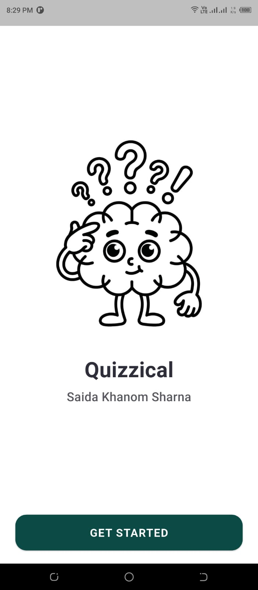
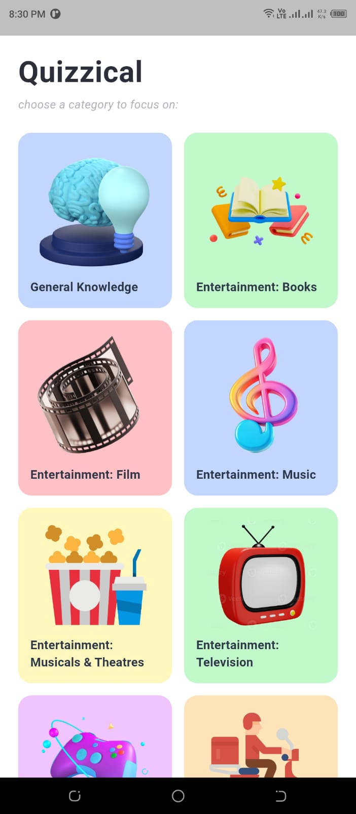
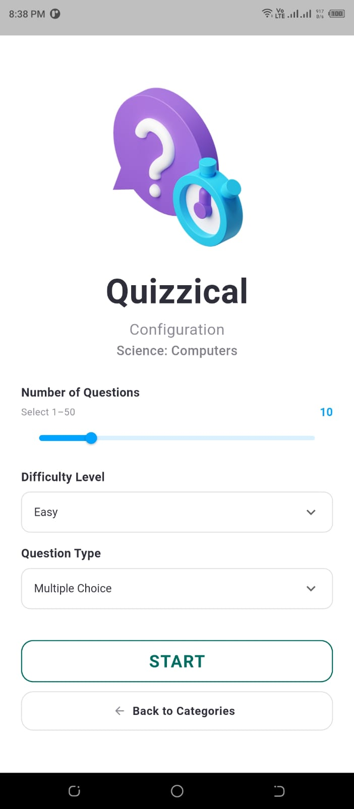
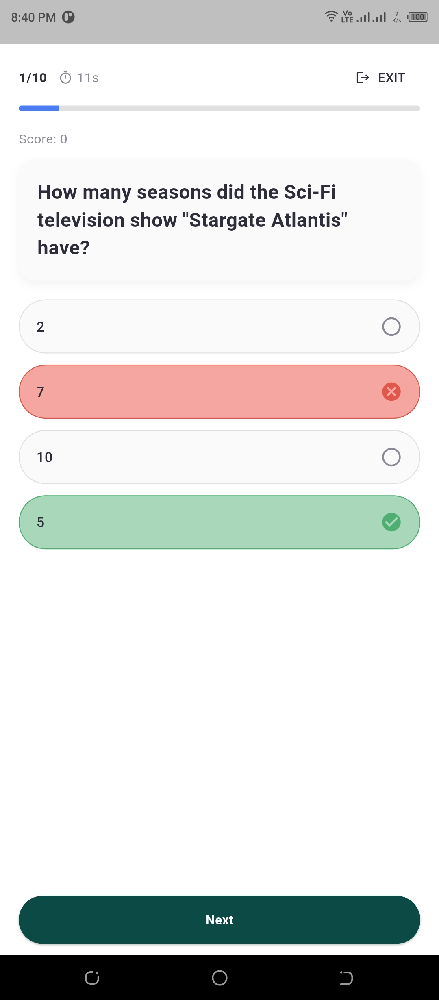
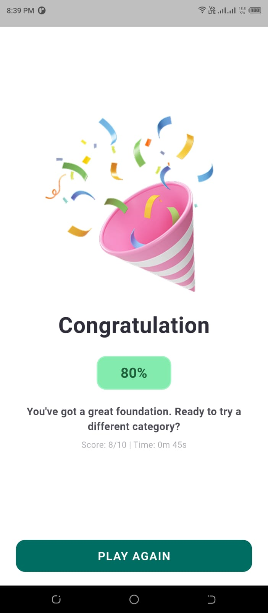
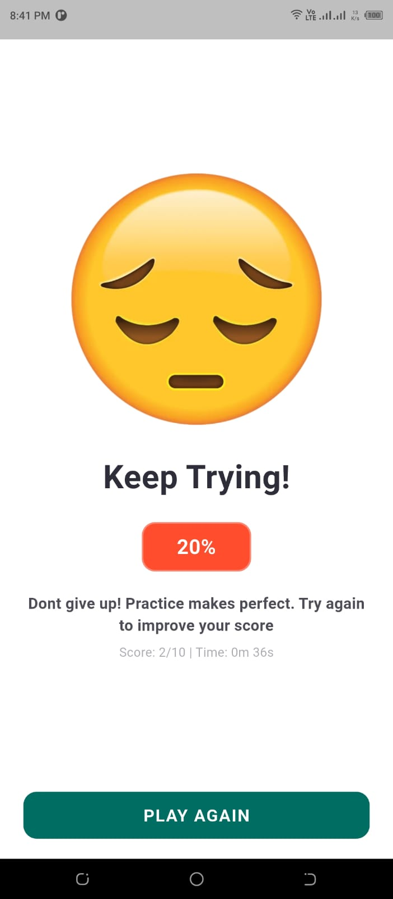

# 🧠 Quizzical

A clean, responsive trivia quiz app built with **Flutter**, powered by the [Open Trivia Database](https://opentdb.com) API. Pick a category, configure your quiz, and test your knowledge against the clock.

---

## 📸 Screenshots


| Welcome | Category Selection | Configuration |
|:---:|:---:|:---:|
|  |  |  |

| Quiz | Result (Success) | Result (Retry) |
|:---:|:---:|:---:|
|  |  |  |

---

## ✨ Features

- 🎯 **Category selection** — visually pick from live categories fetched from OpenTDB, each with its own color and icon
- ⚙️ **Configurable quizzes** — choose number of questions (1–50), difficulty, and question type before you start
- ⏱️ **Timed questions** — a per-question countdown timer with auto-advance on timeout
- ✅ **Instant feedback** — correct/incorrect answers are visually highlighted the moment you select one
- 📊 **Live progress** — question counter and progress bar update as you go
- 🏆 **Results summary** — final score, accuracy percentage, and total time taken
- 🔁 **Replay-friendly** — your last quiz configuration is remembered via `SharedPreferences`
- 📱 **Responsive UI** — adapts cleanly across different screen sizes

---

## 🛠️ Tech Stack

| Category | Choice |
|---|---|
| Framework | [Flutter](https://flutter.dev) |
| Language | Dart |
| State Management | [Provider](https://pub.dev/packages/provider) |
| Networking | [http](https://pub.dev/packages/http) |
| Local Storage | [shared_preferences](https://pub.dev/packages/shared_preferences) |
| Trivia Data | [Open Trivia Database (OpenTDB)](https://opentdb.com) |

---

## 🏗️ Architecture

The app follows a simple **Provider-based MVVM-style** structure:

- **Models** — plain Dart classes that represent API data (`Category`, `Question`)
- **Services** — handles all network calls to OpenTDB, isolated from UI code
- **Providers** — `QuizProvider` (a `ChangeNotifier`) owns all app state: selected category, quiz configuration, current question, score, timer, and results
- **Screens** — one widget per app screen, listening to `QuizProvider` via `Consumer`/`context.watch`
- **Widgets** — small, reusable UI pieces shared across screens (cards, answer options, loading/error states)

This keeps UI code declarative and free of business logic — screens simply render whatever state `QuizProvider` currently holds.

---

## 📁 Project Structure

```
lib/
├── main.dart                     # App entry point, Provider setup, routing
├── models/
│   ├── category.dart              # Category data model
│   └── question.dart              # Question data model (with shuffled answers)
├── services/
│   └── opentdb_service.dart       # OpenTDB API integration
├── providers/
│   └── quiz_provider.dart         # Central app state (ChangeNotifier)
├── utils/
│   ├── app_colors.dart            # App-wide color palette
│   └── category_style.dart        # Maps category names → color/icon
├── widgets/
│   ├── category_card.dart         # Category grid card
│   ├── answer_option.dart         # Answer pill with correct/incorrect states
│   ├── loading_view.dart          # Loading/skeleton state
│   └── error_retry_view.dart      # Error state with retry action
└── screens/
    ├── welcome_screen.dart        # Screen 1 — entry point
    ├── category_screen.dart       # Screen 2 — category selection
    ├── configuration_screen.dart  # Screen 3 — quiz configuration
    ├── quiz_screen.dart           # Screen 4 — live quiz
    └── result_screen.dart         # Screen 5 — results summary
```

---

## 🔌 API Reference

This app consumes two public endpoints from [OpenTDB](https://opentdb.com/api_config.php):

**Categories**
```
GET https://opentdb.com/api_category.php
```

**Questions**
```
GET https://opentdb.com/api.php?amount=<n>&category=<id>&difficulty=<easy|medium|hard>&type=<multiple|boolean>
```

No API key is required.

---

## 🚀 Getting Started

### Prerequisites
- [Flutter SDK](https://docs.flutter.dev/get-started/install) (stable channel)
- A connected device, emulator, or simulator

### Installation

```bash
# 1. Clone the repository
git clone https://github.com/swarnacse19/Quizzical-app-MAD-lab-final.git
cd quizzical

# 2. Install dependencies
flutter pub get

# 3. Run the app
flutter run
```

### Dependencies

Make sure these are present in `pubspec.yaml`:

```yaml
dependencies:
  flutter:
    sdk: flutter
  provider: ^6.1.2
  http: ^1.2.2
  shared_preferences: ^2.3.2
```

---

## 🧩 App Flow

```
Welcome → Category Selection → Configuration → Quiz → Result
                ↑                                          │
                └──────────────── Play Again ──────────────┘
```

- **Exit** during a quiz returns to the **Configuration** screen (not all the way to Welcome), preserving the selected category so the user can quickly restart.
- **Back** on the Configuration screen returns to Category Selection.

---

## 🗺️ Possible Improvements

- [ ] Add a confirmation dialog before exiting an in-progress quiz
- [ ] Add sound effects / haptic feedback on answer selection
- [ ] Persist quiz history / high scores locally
- [ ] Support light/dark theme toggle

---

## 🙏 Acknowledgements

- [Open Trivia Database](https://opentdb.com) for the free trivia API
- [Flutter](https://flutter.dev) & [Provider](https://pub.dev/packages/provider)

